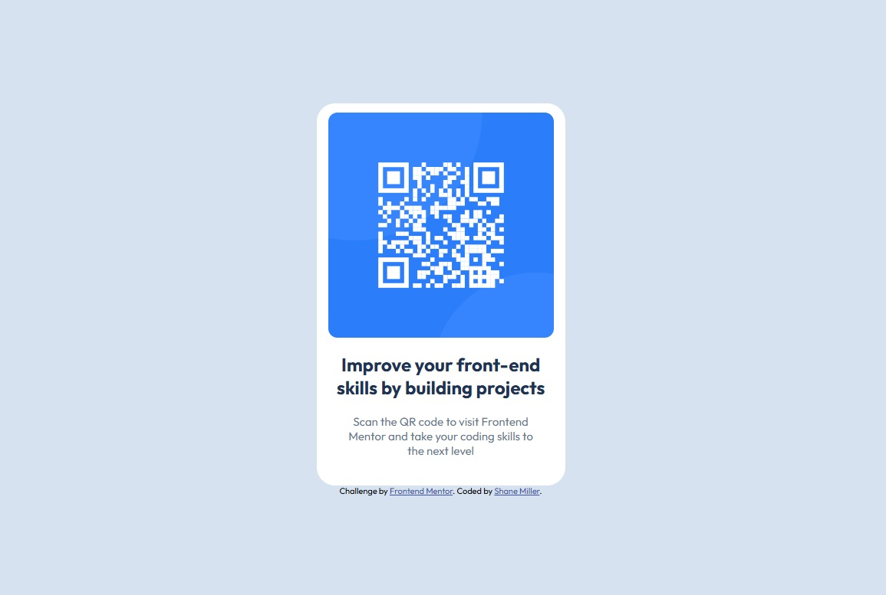

# Frontend Mentor - QR code component solution

This is a solution to the [QR code component challenge on Frontend Mentor](https://www.frontendmentor.io/challenges/qr-code-component-iux_sIO_H). Frontend Mentor challenges help you improve your coding skills by building realistic projects.

## Table of contents

- [Overview](#overview)
  - [Screenshot](#screenshot)
  - [Links](#links)
- [My process](#my-process)
  - [Built with](#built-with)
- [Author](#author)

## Overview

My first project completed through Frontend Mentor website.

### Screenshot

### Links

- Solution URL: [https://github.com/TheOmegaFett/QRCodeForFrontendMentor](https://github.com/TheOmegaFett/QRCodeForFrontendMentor)
- Live Site URL: [https://FEMentorQR.netlify.app/](https://FEMentorQR.netlify.app/)

## My process

- Ensured content was added and html markup was applied, Including semantic html.
- Started applying css properties to parts of the page from top to bottom.
- Ensured to take font, colors and styles into careful consideration to align as closely to the reference design.

### Built with

- Semantic HTML5 markup
- CSS custom properties
- Flexbox
- Mobile-first workflow

## Author

- Website - [Shane Miller](https://shanemiller.netlify.app/)
- Frontend Mentor - [@TheOmegaFett](https://www.frontendmentor.io/profile/TheOmegaFett)
- Twitter - [@Omega43656](https://x.com/Omega43656)
